# Manual de Usuario: Juego Pong
* Jose Julián Rojas Hernández
* Bryan Alberto Molina López
* Jennifer Alexandra Porras Rojas
* Esteban Sánchez Acevedo

---

## Contenido

1. [Descarga e instalación de Ripes](#descarga-e-instalación-de-ripes)
2. [Acceso al código fuente del juego](#acceso-al-código-fuente-del-juego)
3. [Preparación para ejecutar el código en Ripes](#preparación-para-ejecutar-el-código-en-ripes)
4. [Cambios en Ripes](#cambios-en-ripes)
5. [Instrucciones de juego](#instrucciones-de-juego)
6. [Ejecutar el juego](#ejecutar-el-juego)

---

## Descarga e instalación de Ripes

### Descarga

Para ejecutar correctamente el juego, es necesario utilizar el simulador Ripes, una herramienta de código abierto que permite simular procesadores basados en la arquitectura RISC-V.

1. Acceder al repositorio de Ripes: [Ripes Releases](https://github.com/mortbopet/Ripes/releases)
2. Descargar la versión según el sistema operativo en la sección “Assets”.

<p align="center">
  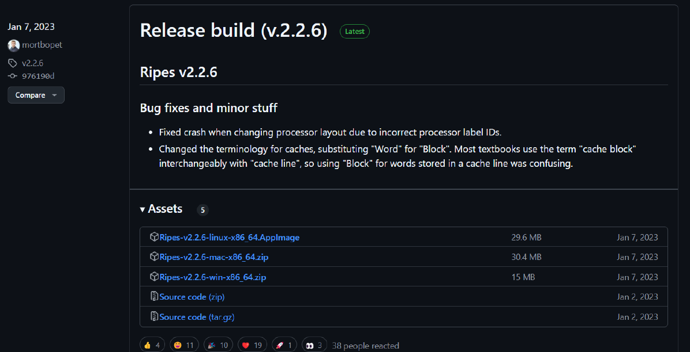
</p>

### Instalar o ejecutar Ripes

* **Windows:** Extraer el archivo `.zip` y ejecutar `Ripes.exe`.
* **Linux:**

  ```bash
  tar -xvzf Ripes-x.y.z-Linux.tar.gz
  cd Ripes-x.y.z-Linux
  chmod +x Ripes
  ./Ripes
  ```
* **macOS:** Abrir `.dmg`, arrastrar el ícono a la carpeta de Aplicaciones y abrir.

---

## Acceso al código fuente del juego

El código está en el archivo `Proyecto Corto 01.s`, disponible en el repositorio: [Proyecto-1-Digitales](https://github.com/JenniferPorrasR/Proyecto-1-Digitales)

<p align="center">
  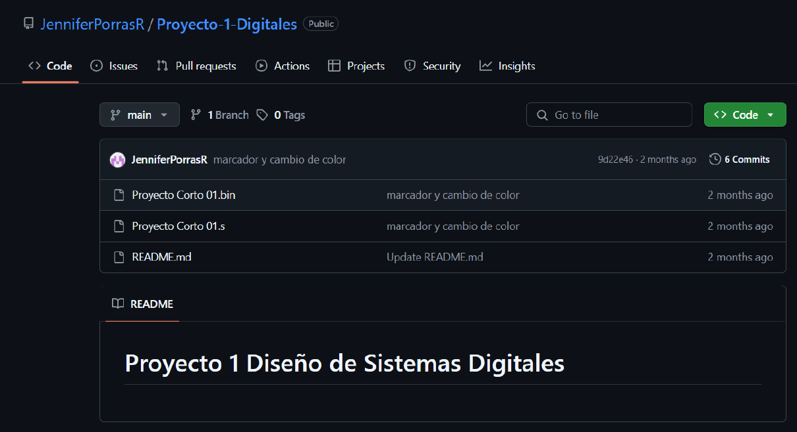
</p>

* Localizar el archivo `Proyecto Corto 01.s`.

* Descargar usando el botón de descarga en la parte superior derecha.

---

## Preparación para ejecutar el código en Ripes

1. Abrir Ripes.
<p align="center">
  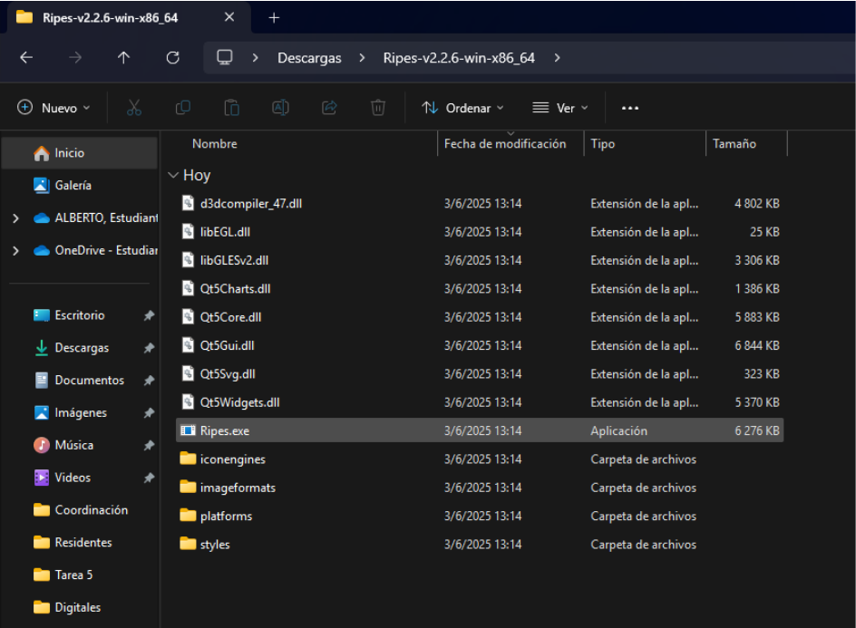
</p>
<p align="center">
  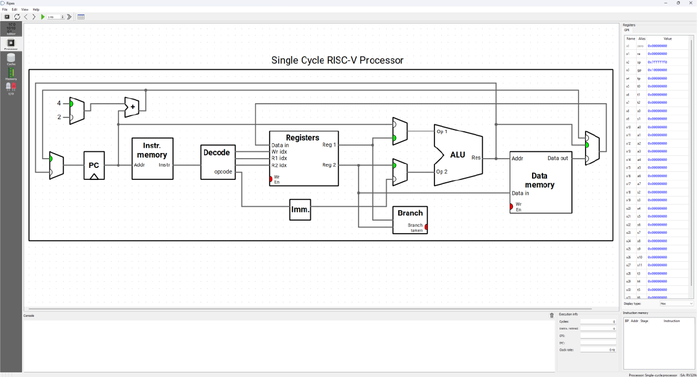
</p>
2. En el menú superior, seleccionar `File` > `Load Program`.
<p align="center">
  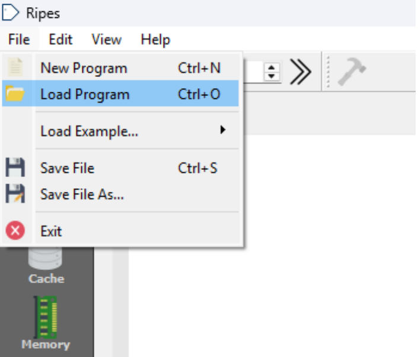
</p>
3. Seleccione “Source File” y luego “Open”. Esto abrirá una ventana
del explorador de archivos, donde deberá elegir el archivo `Proyecto Corto 01.s`.
<p align="center">
  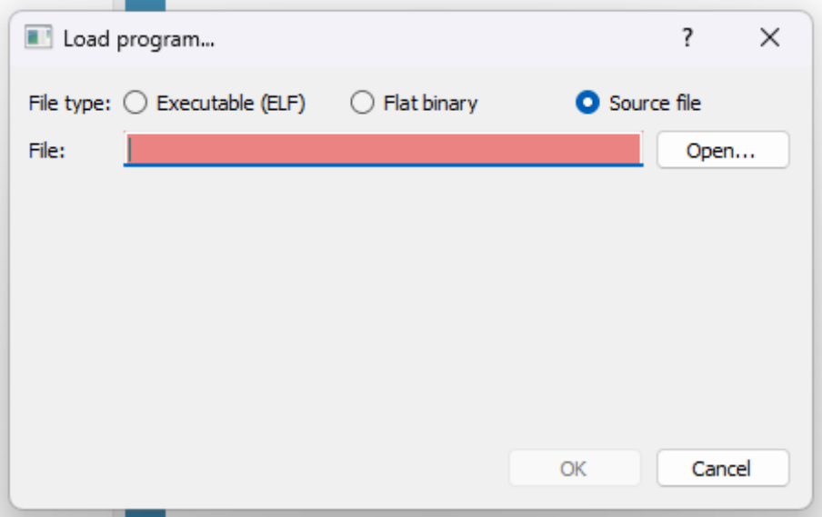
</p>

**Nota:** Si aparece un error entre las líneas 16 y 22
<p align="center">
  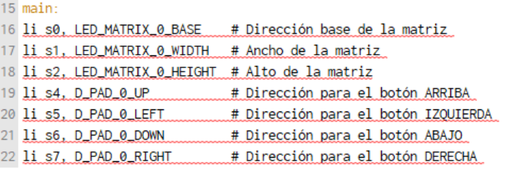
</p>
 
 Cambiar el "Input type" de `Assembly` a `C`, aceptar, y volver a `Assembly`.
 <p align="center">
  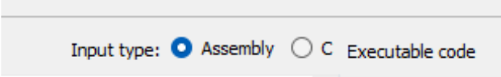
</p>

---

## Cambios en Ripes

Antes de ejecutar el juego, realizar los siguientes cambios:

1. **Procesador:**

 * En la barra lateral izquierda, buscar "Processor".

<p align="center">
  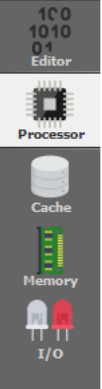
</p>

   * En la barra superior, seleccionar el ícono del procesador.

<p align="center">
  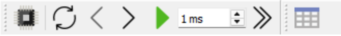
</p>

   * Elegir "Single Cycle RISC-V Processor" y aceptar.

<p align="center">
  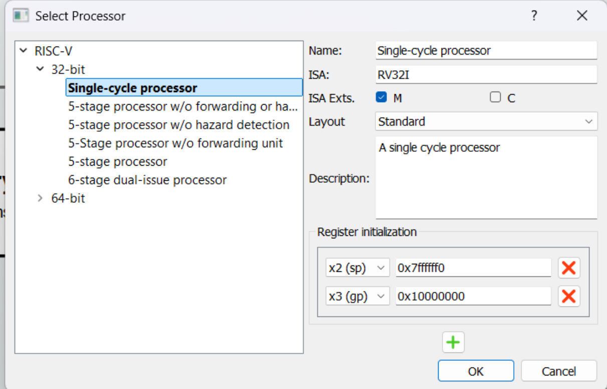
</p>

1. **Tiempo de Reloj:**

   * En la barra superior, establecer el tiempo en `1 ms`.

<p align="center">
  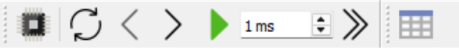
</p>

2. **Matriz de Leds:**

* En la barra lateral izquierda, seleccionar el icono "I/O".

<p align="center">
  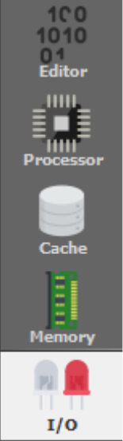
</p>

   * Elegir "LED Matrix".

<p align="center">
  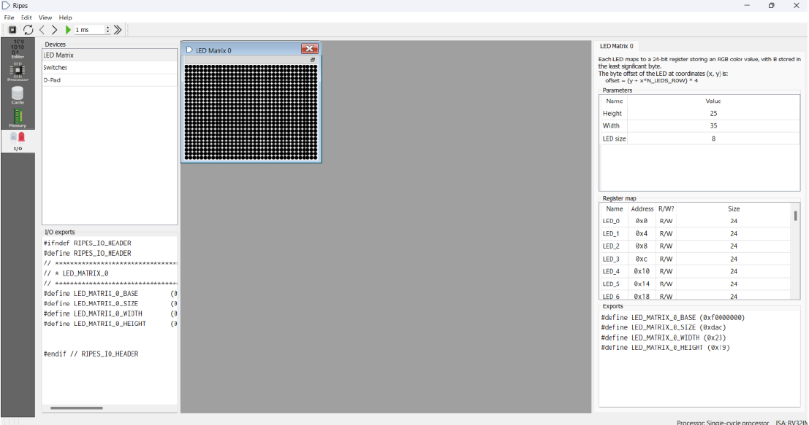
</p>

   * Cambiar la altura (`Height`) de `25` a `28`.

<p align="center">
  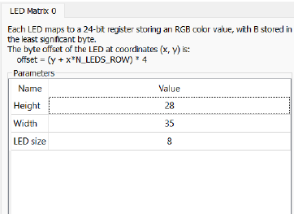
</p>

---

## Instrucciones de juego

Debe abrir el D-Pad para poder jugar.
<p align="center">
  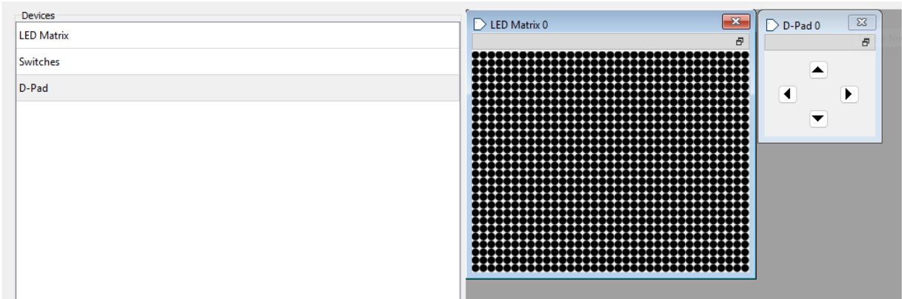
</p>

* **Jugador 1:**

  * Barra morada (izquierda).
  * Botón superior para subir, botón lateral izquierdo para bajar.

* **Jugador 2:**

  * Barra verde (derecha).
  * Botón lateral derecho para subir, botón inferior para bajar.

---

## Ejecutar el juego

Hacer clic en el botón de reproducción (play) en la barra superior. 
<p align="center">
  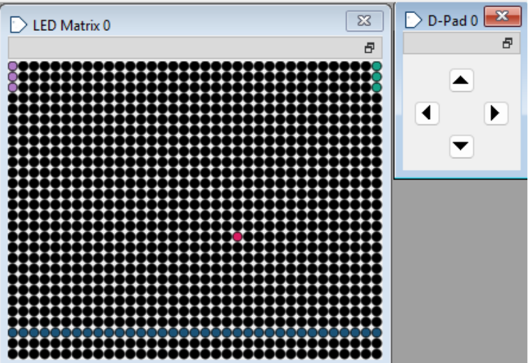
</p>
Las dos últimas líneas de LEDs corresponden al marcador que suma puntos cuando la bola toca la pared del oponente.
<p align="center">
  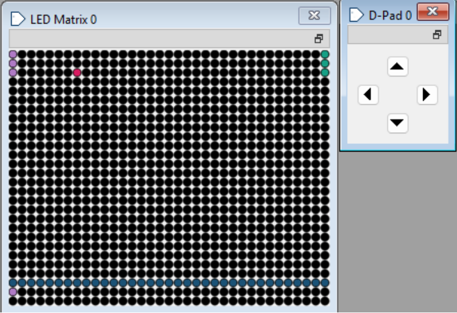
</p>

