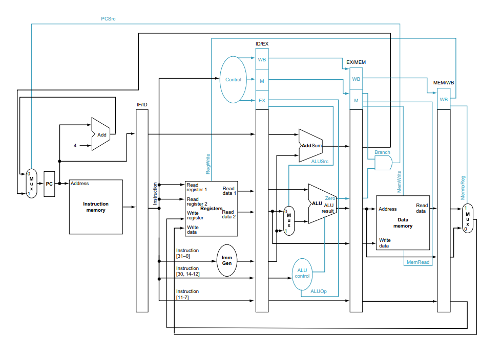

# Procesador Pipeline RISC-V

Este proyecto implementa un procesador RISC-V de 32 bits con arquitectura pipeline de 5 etapas, el cual mejora el rendimiento permitiendo que se ejecuten múltiples instrucciones simultaneamente, cada una en una etapa distinta. 

## Unidades Principales del Sistema

### 1. Instruction Fetch

* Contador de Programa (PC)
* Memoria de Instrucciones
* Sumador para PC+4

### 2. Instruction Decode

* Banco de Registros
* Unidad de Control Principal
* Generador de Inmediatos

### 3. Execution

* Unidad Aritmético-Lógica (ALU)
* ALU control
* Sumador para cálculo de direcciones de salto (PC + inmediato)
* Multiplexor de selección de operandos

### 4. Memory

* Memoria de Datos
* Control de lectura/escritura de memoria

5. Write Back

* Multiplexor para selección de datos de escritura

  

---

## Módulos Implementados y su Correspondencia en el Circuito

### **Etapa IF**

#### `PC.sv`  
Registro que mantiene la dirección de la instrucción actual. Recibe su nueva dirección desde un multiplexor y la envía a la memoria de instrucciones y al sumador.

#### `InstructionMemory.sv`  
Entrega la instrucción de 32 bits según la dirección dada por el PC. Ubicada junto al PC en el circuito.

#### `adder.sv`  
Suma 4 al valor del PC para avanzar a la siguiente instrucción. Conectado directamente al PC.

### **Etapa ID**

#### `Control.sv`  
Decodifica el opcode y genera las señales de control necesarias para las etapas siguientes.

#### `RegisterFile.sv`  
Permite leer dos registros y escribir en uno. Contiene 32 registros de 32 bits.

#### `ImmediateGenerator.sv` 
Extrae y extiende el valor inmediato según el tipo de instrucción (I, S, B, etc.).

### **Etapa EX**

#### `RVALU.sv` 
Ejecuta operaciones aritméticas y lógicas entre operandos. Genera el resultado y una señal Zero.

#### `ALUcontrol.sv` - 
Genera la señal de operación para la ALU, en base al campo funct y a ALUOp.

#### `adder.sv`  
Calcula PC + inmediato para saltos condicionales.

#### `Mux.sv`   
Seleccionan operandos, resultados y destinos según las señales de control.

### **Etapa MEM**

#### `DataMemory.sv` 
Lee o escribe datos en memoria según las señales MemRead y MemWrite. Usa la dirección generada por la ALU.

### **Etapa WB**

#### Multiplexor MemtoReg  
Selecciona entre el valor de la ALU y el valor de memoria para escribir de vuelta al banco de registros.

## Registros de Segmentación

El procesador utiliza registros intermedios entre cada etapa del pipeline para conservar los datos y señales necesarios durante la ejecución de instrucciones.

- **`RegisterIF.sv`**: Guarda el valor de `PC+4` y la instrucción obtenida de memoria, permitiendo su paso desde la etapa **IF (Instruction Fetch)** a **ID (Instruction Decode)**.

- **`RegisterEx.sv`**: Almacena señales de control, datos de los registros fuente, el inmediato y `PC+4`, para ser utilizados durante la etapa **EX (Execute)**.

- **`RegisterWb.sv`**: Conserva el resultado de la ALU, datos provenientes del registro y señales de control para su uso en **MEM (Memory Access)**.

- **`RegisterID.sv`**: Contiene los datos finales (de memoria o de la ALU) y la dirección del registro destino, que serán utilizados en la etapa **WB (Write Back)**.

---

## Reporte de Ejecución del Testbench

### Instrucciones Utilizadas

| Dirección   | Instrucción (Hex) | Tipo  | Descripción                            |
|------------|-------------------|-------|----------------------------------------|
| 0x00000000 | 0x00A00093         | ADDI  | `addi x1, x0, 10` - Cargar 10 en x1    |
| 0x00000004 | 0x00000013         | ADDI  | `addi x0, x0, 0` - NOP                 |
| 0x00000008 | 0x00000013         | ADDI  | `addi x0, x0, 0` - NOP                 |
| 0x0000000C | 0x00000013         | ADDI  | `addi x0, x0, 0` - NOP                 |
| 0x00000010 | 0x00000013         | ADDI  | `addi x0, x0, 0` - NOP                 |
| 0x00000014 | 0x00000013         | ADDI  | `addi x0, x0, 0` - NOP                 |
| 0x00000018 | 0x01E00193         | ADDI  | `addi x3, x0, 30` - Cargar 30 en x3    |
| 0x0000001C | 0x00000013         | ADDI  | `addi x0, x0, 0` - NOP                 |
| 0x00000020 | 0x00000013         | ADDI  | `addi x0, x0, 0` - NOP                 |
| 0x00000024 | 0x00000013         | ADDI  | `addi x0, x0, 0` - NOP                 |
| 0x00000028 | 0x40308333         | SUB   | `sub x6, x1, x3` - x6 = 10 - 30 = -20  |
| 0x0000002C | 0x00000013         | ADDI  | `addi x0, x0, 0` - NOP                 |

### Resultado de la Ejecución del Testbench

| Ciclo | IF (PC) | ID (Instrucción) | EX (Resultado ALU) | MEM  | WB (Escritura)  |
|-------|---------|------------------|---------------------|------|------------------|
| 0     | 0x00    | NOP              | 0x00000000          | ---- | ----             |
| 1     | 0x04    | ADDI             | 0x00000000          | ---- | ----             |
| 2     | 0x08    | ADDI             | 0x0000000A          | ---- | ----             |
| 3     | 0x0C    | ADDI             | 0x00000000          | ---- | ----             |
| 4     | 0x10    | ADDI             | 0x00000000          | ---- | x1 = 0x0A        |
| 5     | 0x14    | ADDI             | 0x00000000          | ---- | ----             |
| 6     | 0x18    | ADDI             | 0x00000000          | ---- | ----             |
| 7     | 0x1C    | ADDI             | 0x00000000          | ---- | ----             |
| 8     | 0x20    | ADDI             | 0x0000001E          | ---- | ----             |
| 9     | 0x24    | ADDI             | 0x00000000          | ---- | ----             |
| 10    | 0x28    | ADDI             | 0x00000000          | ---- | x3 = 0x1E        |
| 11    | 0x2C    | SUB              | 0x00000000          | ---- | ----             |
| 12    | 0x30    | ADDI             | 0xFFFFFFEC          | ---- | ----             |
| 13    | 0x34    | ADDI             | 0x00000000          | ---- | ----             |
| 14    | 0x38    | NOP              | 0x00000000          | ---- | x6 = 0xEC        |
| 15-19 | 0x3C+   | NOP              | -                   | ---- | ----             |

### Estado Final de los Registros

| Registro | Valor (Hex)   | Valor (Decimal) | 
|----------|---------------|-----------------|
| x0       | 0x00000000    | 0               | 
| x1       | 0x0000000A    | 10              | 
| x2       | 0x00000000    | 0               | 
| x3       | 0x0000001E    | 30              | 
| x4       | 0x00000000    | 0               | 
| x5       | 0x00000000    | 0               | 
| x6       | 0xFFFFFFEC    | -20             | 

### Instrucciones en meoria

| Dirección   | Instrucción (Hex)  | Decodificada  | 
|-------------|--------------------|---------------|
| 0x00000000  | 0x00A00093         | ADDI          | 
| 0x00000004  | 0x00000013         | ADDI          | 
| 0x00000008  | 0x00000013         | ADDI          | 
| 0x0000000C  | 0x00000013         | ADDI          | 
| 0x00000010  | 0x00000013         | ADDI          | 
| 0x00000014  | 0x00000013         | ADDI          | 
| 0x00000018  | 0x01E00193         | ADDI          | 
| 0x0000001C  | 0x00000013         | ADDI          | 
| 0x00000020  | 0x00000013         | ADDI          | 
| 0x00000024  | 0x00000013         | ADDI          | 
| 0x00000028  | 0x40308333         | SUB           |
| 0x0000002C  | 0x00000013         | ADDI          | 

### Memoria de Datos

| Dirección | Valor (Hex) | Valor (Decimal) | 
|-----------|-------------|-----------------|
| 0x000     | 0x00000000  | 0               |
| 0x004     | 0x00000000  | 0               | 
| ...       | ...         | ...             | 
| 0x02C     | 0x00000000  | 0               | 

**Nota**: La memoria de datos no se utilizó durante esta ejecución.

